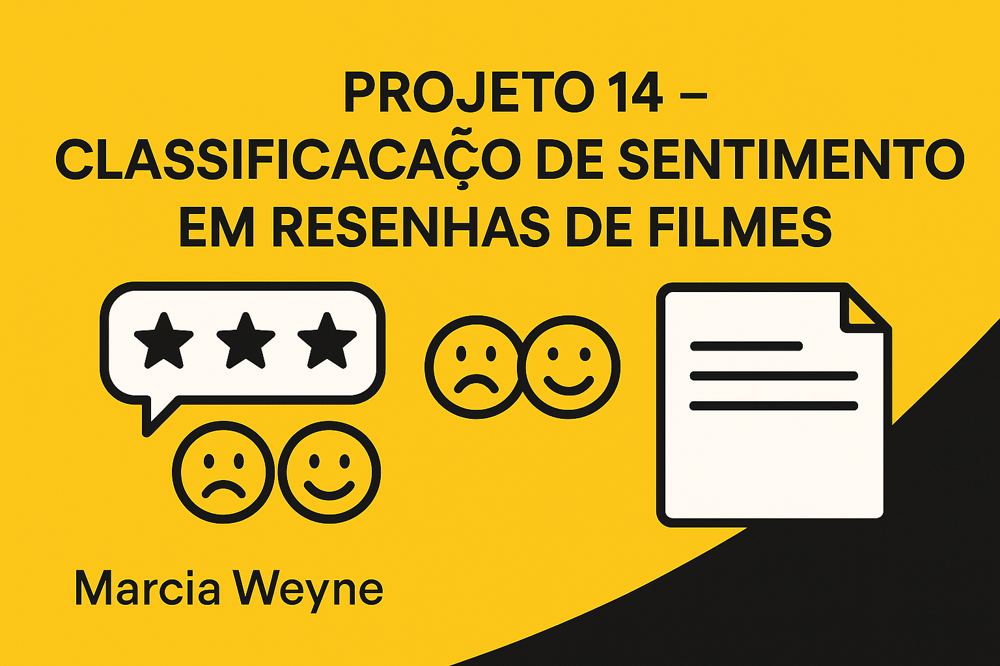

🧠 Projeto 14 – Classificação de Sentimentos em Resenhas de Filmes
Autora: Marcia Weyne
Data: 2025
📝 Descrição do Projeto
Este projeto foi desenvolvido para a comunidade fictícia **Film Junky Union**, com o objetivo de construir um modelo de machine learning capaz de classificar automaticamente resenhas de filmes como positivas ou negativas. A meta principal é atingir um F1-score mínimo de 0.85 para garantir alta precisão na categorização dos sentimentos dos usuários.
📑 Tabela de Conteúdo
- Objetivo
- Resultados
- Ferramentas Utilizadas
- Metodologia
- Como Executar o Projeto
- Aprendizados
- Contato
🏔 Objetivo
Construir modelos de aprendizado de máquina que classifiquem com alta precisão resenhas do IMDB como positivas (1) ou negativas (0), utilizando vetorização com TF-IDF e validação com F1-score.
🏁 Resultados
- 🧹 Limpeza e pré-processamento das resenhas textuais
- 📊 Análise exploratória e avaliação de balanceamento das classes
- 🔠 Vetorização com TF-IDF utilizando unigrams e bigrams
- 🤖 Modelos testados: Regressão Logística, Random Forest e Gradient Boosting
- ✅ Melhor modelo com F1-score ≥ 0.85 no conjunto de teste
- 📝 Testes com resenhas inventadas para verificar robustez
🧰 Ferramentas Utilizadas
- Linguagem: Python
- Ambiente: Jupyter Notebook
- Bibliotecas: pandas • numpy • scikit-learn • matplotlib • seaborn
- Versionamento: Git + GitHub
- Editor: VS Code
🔍 Metodologia
1. **Carregamento e preparação dos dados**
   - Leitura do arquivo TSV
   - Seleção de colunas e remoção de nulos e duplicatas

2. **Limpeza dos textos**
   - Conversão para minúsculas
   - Remoção de pontuação e números

3. **Análise Exploratória**
   - Verificação do balanceamento das classes

4. **Vetorização com TF-IDF**
   - Transformação dos textos em vetores numéricos
   - Consideração de unigrams e bigrams

5. **Treinamento dos modelos**
   - Regressão Logística
   - Random Forest
   - Gradient Boosting

6. **Avaliação e Conclusão**
   - Avaliação com F1-score
   - Testes com resenhas reais e inventadas
   - Escolha do modelo final
💽 Como Executar o Projeto
**Pré-requisitos:**
- Python 3.10 ou superior
- Jupyter Notebook instalado

**Instale as dependências:**
pip install -r requirements.txt
**Execute:**
jupyter notebook
Abra o notebook `P14_classificacao_sentimentos_filmes.ipynb` e siga as etapas descritas.
📝 Aprendizados
**Técnicos:**
- Vetorização de texto com TF-IDF
- Avaliação de modelos com F1-score e matriz de confusão
- Comparação entre diferentes algoritmos de classificação

**Profissionais:**
- Organização de projeto de NLP de forma clara e reprodutível
- Uso de ferramentas de versionamento e documentação
- Validação de resultados com dados reais e novos textos
😄 Contato
Marcia Weyne
📫 mbweyne@gmail.com

 